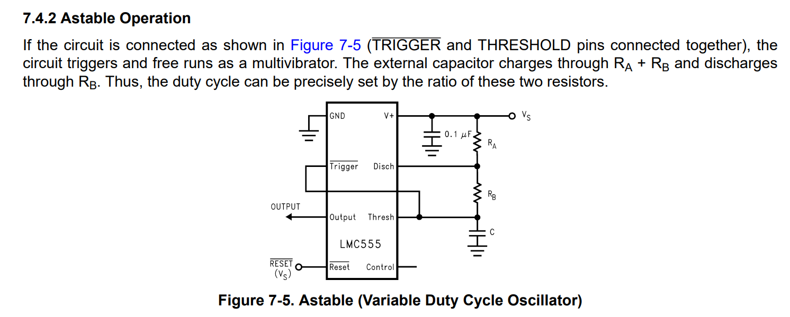

# 555 Timer for Tiny Tapeout 6
 
  ## About
 This project emulates the functionality of the classic 555 Timer IC. 
  
 ## Why
 
Blinking an LED using a 555-Timer has long served as the 'Hello World' for novice electronics enthusiasts. With the ongoing improvement in open-source tools and the emergence of communities like Tiny Tapeout, analog chip design is now within reach for hobbyists, hackers, and other free individuals. In light of this, I decided to take on the challenge of building my own 555 on an IC to blink an LED the hard way.

 
  ## Layout


## Schematics

Conceptually, a 555-Timer is nothing more than a couple of comparators, an internal voltage divider, an SR latch, and an open-drain transistor. These basic functions could be implemented in
numerous ways. My implementation is shown below. See [History](#history) for an original BJT version and its later CMOS counterpart.


Comparator:


## Operation

The 555-Timer has been used to cleverly implement all different kinds of functions. 

Figure 7-5 from the TI datasheet (https://www.ti.com/lit/gpn/LMC555) provides one. The 555 timer is connected as an "astable multivibrator" meaning it runs as an oscillator whose output frequency and duty-cycle are set by the external components.



In this configuration, the frequency of oscillation and duty cycle are a function of the board designer's choice of Ra, Rb, and C.

The amount of time that OUTPUT is high is given by:

\begin{equation}
t_1 = 0.693(R_A+R_B)C
\end{equation}

$$\left
t_1 = 0.693(R_A+R_B)C
\right$$

The amount of time OUTPUT is low:

$`t_2 = 0.693(R_B)C`$

And the overall frequency:

$`f = 1.44/(R_A+2R_B)C`$


## Simulation and Post-Layout Verification

Below I show a top-level testbench which replicates the circuit above.

$`R_A = 1.78k\Omega`$

$`R_B = 4.12k\Omega`$

$`C = 0.01\mu F`$

With these values we expect:

$` t_1 = 40.89\mu s`$

$`t_2 = 28.55\mu s`$

$` f = 14.37kHz`$

The x1 instance is the schematic.

The x2 instance is the RC extracted netlist.


The below Ngspice output shows the resulting waveforms:


Shown above, the measured frequency between the schematic and RC extracted netlist are in close agreement with each other. The frequency is somewhat lower than the analytically
predicted value, but also quite close. 

## Comparator 

The comparator could also be used stand-alone in another application. Below are some Monte-Carlo results where I measured
the offset and hysteresis at TT around a 0.6V threshold:


## How to run the top-level simulation yourself

If you'd like to run the top-level simulation, simply do the following:

``` bash
cd ~
mkdir projects
cd projects
git clone git@github.com:vincentfusco/tt06_555
cd tt06_555/xsch
xschem ./tb/tt_um_vaf_555_timer/tb_tt_um_vaf_555_timer_astable.Schematic
```

## History

The 555 Timer is the most widely used analog IC ever made [1]. It was invented in the era of IC design when layout was still done by hand by cutting Rubylith.

Its inventor was Hans Camenzind, who got the idea for the product when working on PLLs at Signetics (now Phillips). At Signetics, Hans had needed an oscillator whose frequency could be set by an external resistor and capacitor independent of supply voltage.

His first design was the NE566 Voltage-Controlled Oscillator:


The circuit works by charging Cext with a constant-current I = (1/6)Vcc/Rext.

Charging a capacitor with a constant current gives a linear ramp.

This linear ramp rises upwards and can go as high as 2/3 Vcc until the top comparator fires and switches the current to sinking.

This downward linear ramp continues until it gets to 1/3 Vcc when the bottom comparator switches the current back to sourcing.

Thus, the resulting capacitor waveform is a triangle wave which continually bounces between 1/3 Vcc and 2/3 Vcc.

Then, by writing the equation for a constant current into a capacitor:

$`1/3 Vcc = \Delta t C (1/6) Vcc/R`$

$`f = 1/(2 \Delta t)`$

$`f = 1/(4RC)`$

Hans later realized that he had made an incorrect assumption early on about needing the V-to-I converter. He had assumed that only a linear relationship between charge-current and end-voltage would cause Vcc-dependence cancellation, but this was wrong, so he modified the 556, removing the V-to-I, and the 555 was born. The original schematic circuit published by Camenzind himself is shown below [1]:


And a 5V-CMOS verion was later created.


The free e-book written by Camenzind can be found at [2].

[1] https://computerhistory.org/blog/hans-camenzind-remembering-a-wizard-of-analog/

[2] http://www.designinganalogchips.com/.


