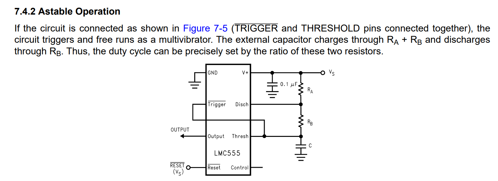

# 555 Timer for Tiny Tapeout 6
 
  ## About
 This project emulates the functionality of the classic 555 Timer IC. 
  
 ## Why
 
Blinking an LED using a 555-Timer has long served as the 'Hello World' for novice electronics enthusiasts. With the ongoing improvement in open-source tools and the emergence of communities like Tiny Tapeout, analog chip design is now within reach for hobbyists, hackers, and other free individuals. In light of this, I decided to take on the challenge of building my own 555 on an IC to blink an LED the hard way.

 
  ## Layout


## Schematics
Timer Top:


Conceptually, a 555-Timer is nothing more than a couple of comparators, an internal voltage divider, an SR latch, and an open-drain transistor. These basic functions could be implemented in
numerous ways. My implementation is shown below. See [History](#history) for an original BJT version and its later CMOS counterpart.

Comparator:


## Operation

The 555-Timer has been used to cleverly implement all different kinds of functions. See the datasheet for the CMOS version here: https://www.ti.com/lit/gpn/LMC555 for some ideas.

Figure 7-5 from the above datasheet shows just one possible application. The 555 timer is connected as an "astable multivibrator" meaning it runs as an oscillator whose output frequency and duty-cycle are set by the external components.



In this configuration, the frequency of oscillation and duty cycle are a function of the board designer's choice of Ra, Rb, and C, given by:

The amount of time that OUTPUT is high:

$`t_1 = 0.693(R_A+R_B)C`$

Amount of time OUTPUT is low:

$`t_2 = 0.693(R_B)C`$

Overall frequency:

$`f = 1.44/(R_A+2R_B)C`$


## Simulation and Post-Layout Verification

Below I show a top-level testbench which replicates the circuit above.

$`R_A = 1.78k\Omega`$

$`R_B = 4.12k\Omega`$

$`C = 0.01\mu F`$

With these values we expect:

$` t_1 = 40.89\mu s`$

$`t_2 = 28.55\mu s`$

$` f = 14.37kHz`$

The x1 instance is the schematic.

The x2 instance is the RC extracted netlist.


The below Ngspice output shows the resulting waveforms:


Shown above, the measured frequency between the schematic and RC extracted netlist are in close agreement with each other. The frequency is somewhat lower than the analytically
predicted value, but also quite close. 

## Comparator 

The comparator could also be used as a piece of stand-alone IP. Below are some Monte-Carlo results where I measured
the offset and hysteresis at TT around a 0.6V threshold:


## How to run the top-level simulation yourself

If you'd like to run the top-level simulation, simply do the following:

``` bash
cd ~
mkdir projects
cd projects
git clone git@github.com:vincentfusco/tt06_555
cd tt06_555/xsch
xschem ./tb/tt_um_vaf_555_timer/tb_tt_um_vaf_555_timer_astable.Schematic
```

## History

The inventor of the original 555 Timer was Hans Camenzind. The idea came from work he did on PLLs while at Signetics (Phillips) in the era when circuit layout was done by hand by cutting Rubylith. 

At Signetics, Hans needed an oscillator whose frequency could
be set by an external resistor and capacitor which was not affected by changes in supply voltage or temperature. 

He quit Signetics and decided to try to make this product a reality.

His original design was the NE566 Voltage-Controlled Oscillator:


In short, this circuit works by charging a capacitor Cext, with a constant-current I = (1/6)Vcc.

Charging a capacitor with a constant current gives a linear ramp.

The capacitor charges between the two thresholds set by Comp. 1 and Comp. 2.

As the capacitor voltage crosses the threshold for each capacitor, set by the 5k Ohm resistor string (which is where the timer gets its name)
the current is steered to either charge or discharge the capacitor Cext.

Thus, the resulting capacitor waveform is a triangle wave which bounces between 1/3 Vcc and 2/3 Vcc.

The Vcc term in the current and the Vcc terms in the thresholds cancel, giving an expression for frequency ultimately independent of supply.

Hans later realized that he had made an incorrect assumption early on about needing the V-to-I converter. He had assumed that only a linear relationship between charge-current and end-voltage would cause Vcc-dependence cancellation, but this was wrong. 

He modified the 556, removing the V-to-I, and the 555 was born. The original schematic circuit is shown below:


And a 5V-CMOS verion was later created.


Hans Camenzind was a legendary analog IC designer. His book is free for download and is available at:
http://www.designinganalogchips.com/.

