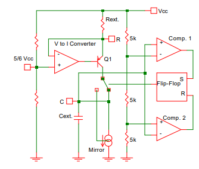

# 555 Timer for Tiny Tapeout 6
 
## About
 This project emulates the functionality of the classic 555 Timer IC. 
  
## Why
 
Blinking an LED using a 555-Timer has long served as the 'Hello World' for novice electronics enthusiasts. With the ongoing improvement in open-source tools and the emergence of communities like Tiny Tapeout, analog chip design is now within reach for hobbyists, hackers, and other free individuals. In light of this, I decided to take on the challenge of building my own 555 on an IC to blink an LED the hard way.
 
## Layout


## Operation

Conceptually, a 555-Timer is nothing more than a couple of comparators, an internal voltage divider to set thresholds, an SR latch, and an open-drain transistor. It can be configured to be used in a variety
of timer, delay, pulse generation, and oscillator applications.

In the figure below, the 555 Timer is configured as an astable multivibrator - a square-wave oscillator.

Suppose at startup the capacitor is at an initial voltage of 0V. S=H, R=L, Q=H, Qb=L. 

The capacitor will begin to charge through a time constant given by $\tau_h = (R_A+R_B)C$.

When the capacitor crosses the $(1/3)Vcc$ mark, the bottom comparator will fire and: S=L, R=L, Q=Hold (H), Qb=Hold (L).

The capacitor continues to charge until it gets to $(2/3)Vcc$. The top comparator will fire and we get: S=L, R=H, Q=L, Qb=H.

The NFET is turned on, so the capacitor will immediately start discharging through a time constant $\tau_h = R_BC$.

As the capacitor voltage goes back below $(2/3)Vcc$, the top comparator will go low again. We have: S=L, R=L, Q=Hold (L), Qb=Hold (H).

The capacitor continues to discharge until it gets back down to $(1/3)Vcc$. The bottom capacitor will fire and we have: S=H, R=L, Q=H, Qb=L.

Now the NFET is off and the capacitor will begin charging again. As the capacitor begins charging we get: S=L, R=L, Q=Hold (H), Qb=Hold (L).

And the cycle continues.

Therefore, the frequency of oscillation and duty cycle are a function of the board designer's choice of RA, RB, and C.


The amount of time that OUT is high is given by:

$$t_1 = \frac{(R_A+R_B)C}{\sqrt{2}}$$

The amount of time OUT is low:

$$t_2 = \frac{R_BC}{\sqrt{2}}$$

And the overall frequency:

$$f = \frac{\sqrt{2}}{(R_A+2R_B)C}$$

## Schematics

The basic functions described above can and have beeen implemented in different ways. 

Schematics of the original BJT version and later CMOS counterpart (with actual sizing given by the creator himself) are given in [History](#history).

### Timer Top

My implementation is shown below:


### Comparator


## Simulation and Post-Layout Verification

Below is a top-level testbench with the tt06_555 configured in the oscillator mode described earlier. This testbench compares the outputs of the schematic vs. the full RC extracted netlists.

$$R_A = 1.78k\Omega$$
$$R_B = 4.12k\Omega$$
$$C = 0.01\mu F$$

With these values we expect:

$$ t_1 = 40.89\mu s$$
$$t_2 = 28.55\mu s$$
$$ f = 14.37kHz$$


The frequency measurement between the simulated schematic and the simulated extracted RC netlist match closely, as shown above.

If you'd like to run the top-level simulation, simply do the following:

``` bash
cd ~
mkdir projects
cd projects
git clone git@github.com:vincentfusco/tt06_555
cd tt06_555/xsch
xschem ./tb/tt_um_vaf_555_timer/tb_tt_um_vaf_555_timer_astable.Schematic
```

## Comparator 

The comparator could also be used stand-alone in another application. Below are some Monte-Carlo results where I measured
the offset and hysteresis at TT around a 0.6V threshold:


## History

The 555 Timer is the most widely used analog IC ever made [1]. It was invented in the era of IC design when layout was still done by hand by cutting Rubylith.

Its inventor was Hans Camenzind, who got the idea for the product when working on PLLs at Signetics (now Phillips). At Signetics, Hans had needed an oscillator whose frequency could be set by an external resistor and capacitor independent of supply voltage.

His first design was the NE566 Voltage-Controlled Oscillator.



The circuit works by charging Cext with a constant-current I = (1/6)Vcc/Rext.

Charging a capacitor with a constant current gives a linear ramp.

This linear ramp rises upwards and can go as high as 2/3 Vcc until the top comparator fires and switches the current to sinking.

The downward linear ramp continues until it gets to 1/3 Vcc when the bottom comparator switches the current back to sourcing.

Thus, the resulting capacitor waveform is a triangle wave which continually bounces between 1/3 Vcc and 2/3 Vcc.

The frequency can be calculated by writing the equation for a constant current into a capacitor:

$$\Delta V = \frac{I\Delta t}{C}$$

We can write:

$$\frac{1}{3Vcc} = \frac{\Delta t(\frac{Vcc}{{6R}})}{C}$$

$$f = \frac{1}{2 \Delta t}$$

$$f = \frac{1}{4RC}$$

After some time Hans realized that the V-to-I converter was not needed. 

He had assumed that only a linear relationship between charge-current and end-voltage would cause Vcc-dependence cancellation, and charging and discharging through an RC also results in the same Vcc cancellation. He modified the 556, removed the V-to-I, and the 555 wasborn.The original schematic circuit published by Camenzind himself is shown below [1]:


And a 5V-CMOS verion was later created.


The free e-book written by Camenzind can be found at [2].

## References

[1] https://computerhistory.org/blog/hans-camenzind-remembering-a-wizard-of-analog/

[2] http://www.designinganalogchips.com/.


